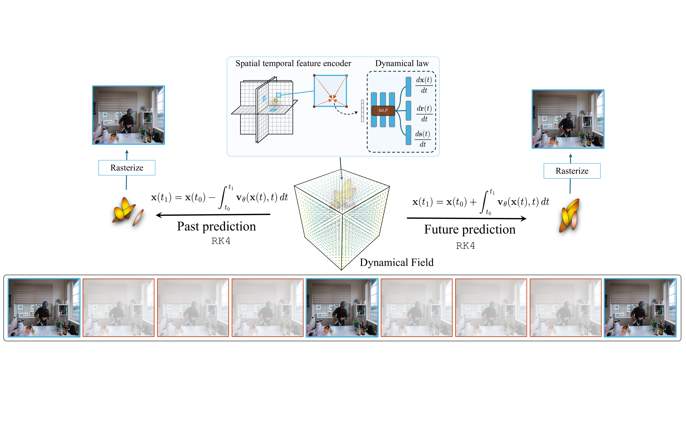

## `EvoGS`: 4D Gaussian Splatting as a Learned Dynamical System

<p >
  <strong><a href="https://cs.princeton.edu/~aa0008">Arnold Caleb Asiimwe</a></strong><sup>1</sup>,&nbsp; <strong><a href="https://cs.columbia.edu/~vondrick">Carl Vondrick</a></strong><sup>2</sup>
  <br>
  <sup>1</sup>Princeton University, &nbsp; <sup>2</sup>Columbia University
  <br>
  <a href="https://arnold-caleb.github.io/evogs"></a>
  <a href="https://arxiv.org/pdf/2512.19648"></a>
  <a href="https://github.com/arnold-caleb/evogs"></a>
</p>

<p >
  
  <em>We learn a continuous-time dynamical system that governs Gaussian primitive evolution through neural velocity fields and ODE integration.</em>
</p>


## Abstract

We reinterpret 4D Gaussian Splatting as a continuous-time dynamical system, where scene motion arises from integrating a learned neural velocity field rather than applying per-frame deformations. This formulation, which we call `EvoGS`, treats the Gaussian representation as an evolving physical system whose state evolves continuously under a learned motion law. 
This unlocks capabilities absent in deformation-based approaches:
1. **Sample-efficient learning** from sparse temporal supervision by modeling the underlying motion law
2. **Temporal extrapolation** enabling forward and backward prediction beyond observed time ranges
3. **Compositional dynamics** that allow localized dynamics injection for controllable scene synthesis

<!-- Experiments on dynamic scene benchmarks show that `EvoGS` achieves better motion coherence and temporal consistency compared to deformation-field baselines while maintaining real-time rendering. -->

---

## 🔥 Highlights

- **Continuous-time dynamics**: Scene motion governed by Neural ODEs, not discrete deformations
- **Sparse supervision**: Learn from every 3rd frame and interpolate the rest
- **Temporal extrapolation**: Predict motion beyond the training time range
- **Real-time rendering**: Maintains 100+ FPS rendering speeds
- **Modular implementation**: Clean, well-documented codebase with 60+ configuration presets

---

## 📋 Table of Contents

- [Installation](#installation)
- [Quick Start](#quick-start)
- [Dataset Preparation](#dataset-preparation)
- [Training](#training)
- [Evaluation](#evaluation)
- [Configuration System](#configuration-system)
- [Code Structure](#code-structure)
- [Citation](#citation)
- [Acknowledgments](#acknowledgments)

---

## 🔧 Installation

### Prerequisites
- Python 3.8+
- CUDA 11.8+ (for GPU support)
- conda or virtualenv

### Step 1: Clone Repository
```bash
git clone https://github.com/arnold-caleb/evogs.git
cd evogs
git submodule update --init --recursive
```

### Step 2: Create Environment
```bash
conda env create -f environment.yml
conda activate evogs
```

### Step 3: Install Submodules
```bash
# Install differential Gaussian rasterization
pip install submodules/diff-gaussian-rasterization

# Install simple-knn
pip install submodules/simple-knn
```

### Step 4: Verify Installation
```bash
python -c "import torch; print(torch.cuda.is_available())"  # Should print True
```

---

## 🚀 Quick Start

### Train `EvoGS` on D-NeRF Lego Scene

```bash
# 1. Download D-NeRF dataset
mkdir -p data/dnerf
cd data/dnerf
# Download from: https://github.com/albertpumarola/D-NeRF
# Extract lego scene to data/dnerf/lego/

# 2. Train with velocity field (EvoGS)
python train.py \
  --source_path data/dnerf/lego \
  --model_path output/evogs_lego \
  --configs arguments/dnerf/lego_velocity.py \
  --iterations 7000

# 3. Render results
python scripts/render_dnerf_temporal.py \
  --model_path output/evogs_lego \
  --configs arguments/dnerf/lego_velocity.py
```

---

## 📂 Dataset Preparation

`EvoGS` supports three dynamic scene benchmarks:

### D-NeRF (Synthetic)
```bash
# Download from: https://github.com/albertpumarola/D-NeRF
# Scenes: lego, mutant, trex, jumpingjacks, standup, hellwarrior, hook, bouncingballs
mkdir -p data/dnerf
# Extract to: data/dnerf/{scene_name}/
```

### DyNeRF (Real-world)
```bash
# Download from: https://github.com/USTC3DV/DyNeRF-Dataset
# Scenes: cut_roasted_beef, coffee_martini, flame_salmon, cook_spinach, sear_steak, flame_steak
mkdir -p data/dynerf
# Extract to: data/dynerf/{scene_name}/
```

### HyperNeRF (Deformable)
```bash
# Download from: https://github.com/google/hypernerf
# Format: Nerfies dataset format
mkdir -p data/hypernerf
# Extract to: data/hypernerf/{scene_name}/
```

---

## 🎯 Training

### Basic Training

```bash
python train.py \
  --source_path data/dnerf/lego \
  --model_path output/evogs_lego \
  --configs arguments/dnerf/lego_velocity.py \
  --iterations 7000
```

### Training Modes

#### 1. Standard Velocity Field (`EvoGS`)
```bash
python train.py \
  --source_path data/dynerf/cut_roasted_beef \
  --model_path output/velocity/cut_roasted_beef \
  --configs arguments/dynerf/cut_roasted_beef_velocity.py \
  --start_checkpoint output/static_4anchors/frame0/chkpnt30000.pth
```

#### 2. Sparse Temporal Supervision
Train on every 3rd frame and let the velocity field interpolate the rest:
```bash
python train.py \
  --source_path data/dynerf/cut_roasted_beef \
  --model_path output/velocity_sparse/cut_roasted_beef \
  --configs arguments/dynerf/cut_roasted_beef_sparse_stride3.py \
  --start_checkpoint output/static_4anchors/frame0/chkpnt30000.pth
```

#### 3. Future Reconstruction (Temporal Extrapolation)
Train on the first 50% of frames and predict the remaining 50%:
```bash
python train.py \
  --source_path data/dynerf/cut_roasted_beef \
  --model_path output/velocity_future/cut_roasted_beef \
  --configs arguments/dynerf/cut_roasted_beef_future_velocity.py \
  --start_checkpoint output/static_4anchors/frame0/chkpnt30000.pth
```

#### 4. Displacement Field (4DGaussians Baseline)
```bash
python train.py \
  --source_path data/dynerf/cut_roasted_beef \
  --model_path output/displacement/cut_roasted_beef \
  --configs arguments/dynerf/cut_roasted_beef_displacement.py
```

### Gaussian Waypoints (Anchor Training)

When training with sparse temporal supervision or future reconstruction, the velocity field must integrate over long time spans. This can lead to **integration drift** — small errors that accumulate and cause the evolved Gaussians to diverge from the true scene. **Gaussian waypoints** (anchors) stabilize this by providing pre-optimized 3D Gaussian checkpoints at specific timesteps that the velocity field is encouraged to pass through during integration.

Think of waypoints as **ground-truth targets at key frames**: if you know what the scene should look like at `t = 0.0, 0.25, 0.50, 0.75`, the velocity field can be penalized when its integrated trajectory drifts away from those checkpoints. This is the **anchor loss**.

#### Step 1: Train the Canonical Gaussians (Frame 0)

First, train a static 3D Gaussian model on the first frame. This becomes your initial condition *and* the canonical Gaussian set — every subsequent anchor will start from these same Gaussians to ensure **Gaussian correspondence** (Gaussian #i always refers to the same physical point across all anchors).

```bash
python train_anchor.py \
  --source_path data/dynerf/cut_roasted_beef \
  --model_path output/static_4anchors/frame0 \
  --configs arguments/static/cut_roasted_beef_frame0_hq.py \
  --dataset_type dynerf_static \
  --frame_idx 0 \
  --iterations 30000 \
  --checkpoint_iterations 30000
```

#### Step 2: Train Additional Anchor Frames

For each additional anchor (e.g., frames 75, 150, 225), load the canonical checkpoint from Step 1 and optimize positions to fit that frame. This preserves the Gaussian count and correspondence:

```bash
# Frame 75 (t = 0.25)
python train_anchor.py \
  --source_path data/dynerf/cut_roasted_beef \
  --model_path output/static_4anchors/frame75 \
  --configs arguments/static/cut_roasted_beef_anchor.py \
  --dataset_type dynerf_static \
  --frame_idx 75 \
  --canonical_checkpoint output/static_4anchors/frame0/chkpnt30000.pth \
  --iterations 30000 \
  --checkpoint_iterations 30000

# Frame 150 (t = 0.50)
python train_anchor.py \
  --source_path data/dynerf/cut_roasted_beef \
  --model_path output/static_4anchors/frame150 \
  --configs arguments/static/cut_roasted_beef_anchor.py \
  --dataset_type dynerf_static \
  --frame_idx 150 \
  --canonical_checkpoint output/static_4anchors/frame0/chkpnt30000.pth \
  --iterations 30000 \
  --checkpoint_iterations 30000

# Frame 225 (t = 0.75)
python train_anchor.py \
  --source_path data/dynerf/cut_roasted_beef \
  --model_path output/static_4anchors/frame225 \
  --configs arguments/static/cut_roasted_beef_anchor.py \
  --dataset_type dynerf_static \
  --frame_idx 225 \
  --canonical_checkpoint output/static_4anchors/frame0/chkpnt30000.pth \
  --iterations 30000 \
  --checkpoint_iterations 30000
```

> **SLURM users**: See `evogs_scripts/train_anchors.slurm` which automates all 4 anchor trainings sequentially.

#### Step 3: Train the Velocity Field with Waypoints

Point your scene config at the anchor checkpoints (see `arguments/dynerf/cut_roasted_beef_velocity.py` for an example):

```python
# arguments/dynerf/my_scene_velocity.py
_base_ = './base_velocity.py'

ModelHiddenParams = dict(
    use_multi_anchor = True,
    anchor_checkpoints = {
        0.00: "output/static_4anchors/frame0/chkpnt30000.pth",
        0.25: "output/static_4anchors/frame75/chkpnt30000.pth",
        0.50: "output/static_4anchors/frame150/chkpnt30000.pth",
        0.75: "output/static_4anchors/frame225/chkpnt30000.pth",
    },
)
```

Then train, initializing from the frame 0 anchor:

```bash
python train.py \
  --source_path data/dynerf/cut_roasted_beef \
  --model_path output/velocity/cut_roasted_beef \
  --configs arguments/dynerf/cut_roasted_beef_velocity.py \
  --start_checkpoint output/static_4anchors/frame0/chkpnt30000.pth
```

> **SLURM users**: See `evogs_scripts/train_dynerf_all.slurm`.

#### How the Anchor Loss Works

During training, the velocity field integrates the trainable Gaussians from `t = 0` to each anchor time. The **anchor loss** penalizes the L2 distance between the evolved Gaussian positions and the pre-optimized anchor positions:

```
L_anchor = λ_anchor · mean(|| x_evolved(t_anchor) - x_anchor ||²)
```

This gives the velocity field direct 3D supervision at the anchor timesteps, preventing drift without requiring per-frame deformation fitting. The key parameters are:

| Parameter | Description | Default |
|-----------|-------------|---------|
| `lambda_anchor` | Weight of the anchor loss | `0.0` (off) / `1.0` (future) |
| `anchor_loss_interval` | Compute anchor loss every N iterations | `10` |

> **Important**: `--start_checkpoint` must point to the same frame 0 checkpoint used as the canonical source for anchors. This ensures the trainable Gaussians have the same count (`N`) as the anchors, which is required for the 1-to-1 position comparison.

---

## 📊 Evaluation

### Render Test Views

Each dataset has a dedicated rendering script in `scripts/`:

```bash
# D-NeRF scenes
python scripts/render_dnerf_temporal.py \
  --model_path output/evogs_lego \
  --configs arguments/dnerf/lego_velocity.py

# DyNeRF scenes (velocity field)
python scripts/render_velocity_field_temporal.py \
  --model_path output/velocity/cut_roasted_beef \
  --configs arguments/dynerf/cut_roasted_beef_velocity.py

# HyperNeRF scenes
python scripts/render_hypernerf_temporal.py \
  --model_path output/hypernerf/interp_cut_lemon \
  --configs arguments/hypernerf/interp_cut_lemon_velocity.py
```

> **SLURM users**: See `evogs_scripts/render_dnerf_all.slurm`, `evogs_scripts/render_velocity_field.slurm`, and `evogs_scripts/render_hypernerf.slurm`.

### Compute Metrics
```bash
./scripts/evaluate_model.sh output/velocity/cut_roasted_beef
```

Metrics computed:
- **PSNR** (Peak Signal-to-Noise Ratio)
- **SSIM** (Structural Similarity Index)
- **LPIPS** (Learned Perceptual Image Patch Similarity)

---

## ⚙️ Configuration System

`EvoGS` uses a clean, inheritance-based configuration system that eliminates code duplication.

### Configuration Structure

```
arguments/
├── dnerf/                   # D-NeRF dataset (synthetic)
│   ├── base.py             # Base config for all D-NeRF scenes
│   ├── base_velocity.py    # `EvoGS` velocity field defaults
│   ├── lego.py             # Lego scene (2 lines!)
│   ├── lego_velocity.py    # Lego with velocity field (1 line!)
│   └── README.md           # Full documentation
│
├── dynerf/                  # DyNeRF dataset (real-world)
│   ├── base.py             # Base config
│   ├── base_velocity.py    # Velocity field defaults
│   ├── base_displacement.py # Displacement field defaults
│   ├── base_sparse.py      # Sparse supervision defaults
│   ├── base_future.py      # Future reconstruction defaults
│   └── README.md           # Full documentation
│
└── hypernerf/               # HyperNeRF dataset
    ├── base.py             # Base config (nerfies format)
    └── README.md           # Full documentation
```

### Example: Creating a New Scene Config

```python
# arguments/dnerf/my_scene_velocity.py
"""My custom scene with velocity field"""
_base_ = './base_velocity.py'

# Only override what's different!
OptimizationParams = dict(
    iterations = 10000,  # Longer training
)
```

That's it! All other parameters inherit from `base_velocity.py`.

See `arguments/dnerf/README.md` for complete documentation.

---

## 🏗️ Code Structure

### Core Implementation

```
scene/velocity/              # EvoGS velocity field (our contribution!)
├── __init__.py             # Public API
├── field.py                # VelocityField neural network architecture
├── integration.py          # ODEIntegrator with RK4/Euler methods
├── network.py              # velocity_network wrapper
├── quaternion_utils.py     # Quaternion kinematics for rotations
└── utils.py                # Utilities (divergence, rollout, etc.)

scene/                       # Gaussian Splatting scene
├── gaussian_model.py       # 3D Gaussian primitives
├── deformation.py          # Deformation/velocity networks
├── hexplane.py             # HexPlane grid feature encoding
├── dataset_readers.py      # Data loaders for all datasets
└── sparse_temporal_sampler.py  # Sparse supervision sampler

train.py                     # Main training script (velocity field / displacement)
train_anchor.py              # Train static Gaussian waypoints for anchor loss
scripts/                     # Dataset-specific rendering & evaluation scripts
evogs_scripts/               # SLURM job scripts for cluster training
gaussian_renderer/           # Differentiable rasterization
utils/                       # General utilities
```

### Key Features of the Velocity Field

**Continuous-time dynamics:**
```python
# scene/velocity/field.py
def forward(self, x, t):
    """Compute velocity v(x,t) at position x and time t"""
    return self.velocity_network(x, t)

# scene/velocity/integration.py
def integrate(self, x0, t_span, method='rk4'):
    """Integrate from x0 over t_span using Neural ODE"""
    return odeint(self.ode_func, x0, t_span, method=method)
```

**Dual rotation modes:**
- Standard: Predict quaternion directly
- Angular velocity (geometrically correct): Predict ω, integrate via `dq/dt = 0.5 * q ⊗ [0, ω]`

---

## 📖 Key Concepts

### What is a Velocity Field?

Instead of learning per-frame deformations `Δx_t`, `EvoGS` learns a **velocity field** `v(x,t)` that describes how each point moves:

```
Traditional: x_t = x_0 + Δx_t              (discrete)
`EvoGS`:    dx/dt = v(x,t)                  (continuous)
            x_t = x_0 + ∫₀ᵗ v(x(τ),τ) dτ   (integrated)
```

This formulation:
- ✅ Naturally handles sparse/missing frames
- ✅ Enables temporal extrapolation
- ✅ Enforces motion smoothness
- ✅ Allows compositional dynamics

### Neural ODE Integration

We use `torchdiffeq` for numerical integration:
- **Euler** (fast, 1st order accuracy): Good for quick experiments
- **RK4** (slower, 4th order accuracy): Better for long-range integration

---

## 🔬 Experiments

### Ablation Studies

We provide configs for all ablations in the paper:

| Experiment | Config | Description |
|------------|--------|-------------|
| Sparse supervision (stride 3) | `arguments/dynerf/cut_roasted_beef_sparse_stride3.py` | Train on every 3rd frame |
| Future reconstruction | `arguments/dynerf/cut_roasted_beef_future_velocity.py` | Train on first 50%, predict rest |
| Multi-anchor | `arguments/dynerf/cut_roasted_beef_multi_anchor.py` | Reduce integration drift with waypoints |
| RK4 integration | `arguments/dynerf/cut_roasted_beef_velocity_rk4_a100.py` | 4th-order Runge-Kutta |
| XYZ-only | `arguments/dynerf/cut_roasted_beef_velocity_xyz_only.py` | Position velocity only (no rotation/scale) |
| Displacement baseline | `arguments/dynerf/cut_roasted_beef_sparse_displacement.py` | 4DGS deformation baseline |

See configuration READMEs (`arguments/dynerf/README.md`) for the full list.

---

## 📝 Citation

If you find this work useful, please cite:

```bibtex
@misc{asiimwe20254dgaussiansplattinglearned,
      title={4D Gaussian Splatting as a Learned Dynamical System}, 
      author={Arnold Caleb Asiimwe and Carl Vondrick},
      year={2025},
      eprint={2512.19648},
      archivePrefix={arXiv},
      primaryClass={cs.CV},
      url={https://arxiv.org/abs/2512.19648}, 
}
```

---

## 🙏 Acknowledgments

This project builds upon several excellent codebases:
- [3D Gaussian Splatting](https://github.com/graphdeco-inria/gaussian-splatting) for the base renderer
- [4D Gaussian Splatting](https://github.com/hustvl/4DGaussians) for dynamic scene extensions
- [HexPlane](https://github.com/Caoang327/HexPlane) for efficient 4D feature grids
- [torchdiffeq](https://github.com/rtqichen/torchdiffeq) for Neural ODE integration

We thank the authors of D-NeRF, DyNeRF, and HyperNeRF for releasing their datasets.

---

## 📄 License

This project is licensed under the Gaussian Splatting License. See [LICENSE.md](LICENSE.md) for details.

---

<!-- ## 🐛 Issues and Questions

- **Issues:** Please open a GitHub issue
- **Questions:** Check the configuration READMEs first, then open an issue
- **Contributions:** Pull requests welcome!

--- -->

## 🔗 Links

- **Project Page:** https://arnold-caleb.github.io/evogs
- **Paper (arXiv):** https://arxiv.org/pdf/2512.19648 
- **D-NeRF Dataset:** https://github.com/albertpumarola/D-NeRF
- **DyNeRF Dataset:** https://github.com/USTC3DV/DyNeRF-Dataset
- **HyperNeRF Dataset:** https://github.com/google/hypernerf

---

<p align="center">
  <em>"Everything flows" — Heraclitus</em>
</p>
